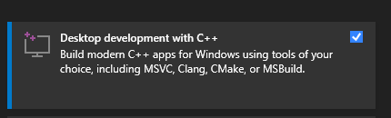

## Creating UDF (User Defined Function) on Postgresql 14 x64 

- Install Postgresql for Windows
- Install Visual Studio and Visual Studio Code
- Install the Desktop development with C++ workload



- Windons -> Development 


- Validate


- Create a folder poc_dll

- Create a file poc_x64.c

Template

```C
#include "postgres.h"
#include <string.h>
#include "fmgr.h"
#include "utils/geo_decls.h"
#include <stdio.h>
#include <winsock2.h>
#include "utils/builtins.h"
#pragma comment(lib, "shell32.lib")


PG_MODULE_MAGIC;

PGDLLEXPORT Datum poc(PG_FUNCTION_ARGS);
PG_FUNCTION_INFO_V1(poc);

Datum
poc(PG_FUNCTION_ARGS)
{
#define GET_STR(textp) DatumGetCString(DirectFunctionCall1(textout, PointerGetDatum(textp)))

    int32  instances = PG_GETARG_INT32(1);
 
    for (int c = 0; c < instances; c++) {
        /*launch the process passed in the first parameter*/
        ShellExecute(NULL, "open", GET_STR(PG_GETARG_TEXT_P(0)), NULL, NULL, 1);
    }
    PG_RETURN_VOID();
}
s
```
- Open a cmd.exe and run follow commands

```

cd "C:\Program Files (x86)\Microsoft Visual Studio\2019\Community\"
%comspec% /k "C:\Program Files (x86)\Microsoft Visual Studio\2019\Community\VC\Auxiliary\Build\vcvars64.bat"
```


- Goto src directory

- Compile

```

"C:\Program Files (x86)\Microsoft Visual Studio\2019\Community\VC\Tools\MSVC\14.28.29910\bin\HostX86\x64\CL.exe" /c /I"C:\Program Files\PostgreSQL\14\include\server\port\win32" /I"C:\Program Files\PostgreSQL\14\include" /I"C:\Program Files\PostgreSQL\14\include\server" /Zi /nologo /W3 /WX- /diagnostics:column /sdl /O2 /Oi /GL /D WIN32 /Gm- /MD /GS /Gy /fp:precise /permissive- /Zc:wchar_t /Zc:forScope /Zc:inline /Fo"poc_x64" /Fd"poc_x64.pdb" /Gd /TC /FC /errorReport:prompt poc_x64.c
```


- Link

```

"C:\Program Files (x86)\Microsoft Visual Studio\2019\Community\VC\Tools\MSVC\14.28.29910\bin\HostX86\x64\link.exe" /ERRORREPORT:PROMPT /OUT:"poc_x64.dll" /INCREMENTAL:NO /NOLOGO /LIBPATH:"C:\Program Files\PostgreSQL\14\lib" postgres.lib /MANIFEST:NO /DEBUG /PDB:"poc_x64.pdb" /SUBSYSTEM:CONSOLE /OPT:REF /OPT:ICF /LTCG:incremental /LTCGOUT:"poc_x64.iobj" /TLBID:1 /DYNAMICBASE /NXCOMPAT /IMPLIB:"poc_x64.lib" /MACHINE:X64 /DLL poc_x64.obj
```

- Load Function at Postgresql, connect to psql and run

```

create or replace function poc(text, integer) returns void as $$c:\poc_x64.dll$$,$$poc$$ language c strict;
CREATE FUNCTION
select poc($$notepad.exe$$,5);
 poc
-----

(1 row)


postgres=#

```


